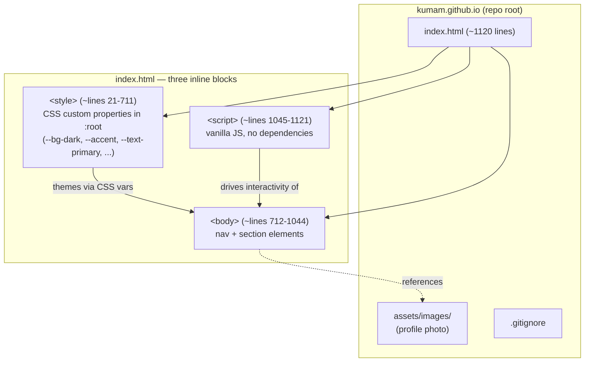
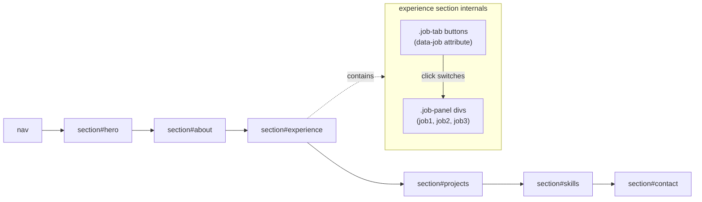
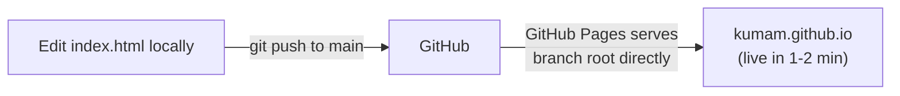

# How this repo works

`kumam.github.io` is a single-page static portfolio site with no build system, no
package manager, and no test suite. Everything lives in one file, `index.html`, deployed
directly by GitHub Pages.

## Component overview

## Page sections (in DOM order)

## JavaScript behavior (`<script>` block)

No dependencies, four responsibilities:

1. **Mobile nav toggle** — shows/hides the nav on small screens.
2. **Experience tab switching** — clicking a `.job-tab` shows the matching `.job-panel`
   (matched via `data-job`).
3. **Scroll-reveal** — `IntersectionObserver` watches each `.section` element and
   reveals it as it enters the viewport.
4. **Smooth-scroll** — in-page anchor links (`nav` → sections) scroll smoothly instead
   of jumping.

## Styling approach (`<style>` block)

All theming goes through CSS custom properties declared once in `:root`
(`--bg-dark`, `--bg-light`, `--accent`, `--text-primary`, etc.) — change the color
scheme by editing these variables, not individual selectors throughout the file.

## Deployment

No CI, no build step — GitHub Pages serves `index.html` directly from the `main` branch
root. Local preview: open `index.html` in a browser, or `python -m http.server 8000`.

## External dependencies

CDN-only, no npm packages: Google Fonts (Inter) and Font Awesome icons, both loaded via
`<link>` tags in `<head>`. The favicon is an inline SVG data URI (`<MK>` text mark), not
a separate file.

## Content editing

Personal details (name, links, job history, projects, skills) are hardcoded inline in
`index.html` — there's no separate data/config file to look for. See `CLAUDE.md` at the
repo root for exact line ranges and editing notes.
